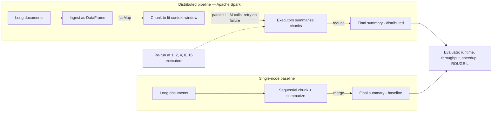

# Pipeline Workflow

## Features

| Node      | Feature                              | Priority |
| --------- | ------------------------------------ | -------- |
| `A1`      | Load long-document dataset           | P0       |
| `B1`      | Store documents as Spark DataFrame   | P0       |
| `C1`      | Chunk documents with Spark `flatMap` | P0       |
| `D1`      | Parallel LLM summarization           | P0       |
| `D1`      | Retry failed LLM calls               | P0       |
| `E1`      | Merge chunk summaries                | P0       |
| `E1`      | Re-summarize oversized merged output | P0       |
| `A2`→`C2` | Single-node sequential baseline      | P0       |
| `S0`      | Test 1/2/4/8/16 executors            | P0       |
| `EVAL`    | Runtime and throughput               | P0       |
| `EVAL`    | Speedup vs. baseline                 | P0       |
| `EVAL`    | ROUGE-L quality                      | P0       |

## Optional Features

| Node   | Feature                     | Priority |
| ------ | --------------------------- | -------- |
| `C1`   | Semantic/paragraph chunking | P1       |
| `D1`   | Compare multiple LLMs       | P1       |
| `D1`   | GPU inference               | P2       |
| `D1`   | Worker fault tolerance      | P2       |
| `EVAL` | Results dashboard           | P2       |
| `A1`   | Streaming input              | P2       |

## Timeline

All dates are tentative and should be confirmed on LEARN.

| Date | Deliverable |
| --- | --- |
| October 6, 2026 | Test 1 |
| October 9, 2026 | Project proposal due |
| October 19, 2026 | Paper review 1 due |
| October 23, 2026 | Programming assignment demonstration appointment deadline |
| October 27-30, 2026 | Programming assignment due window |
| November 17, 2026 | Test 2 |
| November 19, 2026 | Paper review 2 due |
| November 20, 2026 | Project title and group information due |
| December 3 or December 8, 2026 | Project presentation |
| December 11, 2026 | Project report, implementation, reproduction how-to, and other project deliverables due |

### Project delivery checklist

- **Project proposal - October 9:** Problem, scalability requirements, proposed solution, research methodology, work plan, related work, and group-member names.
- **Project presentation - December 3 or 8:** Completed-project presentation with participation from every group member, followed by approximately three minutes of Q&A.
- **Project report - December 11:** At least four pages excluding references, using the IEEE double-column format.
- **Implementation package - December 11:** Code archive and a reproduction how-to with dataset locations. Do not include input datasets or large output files.
