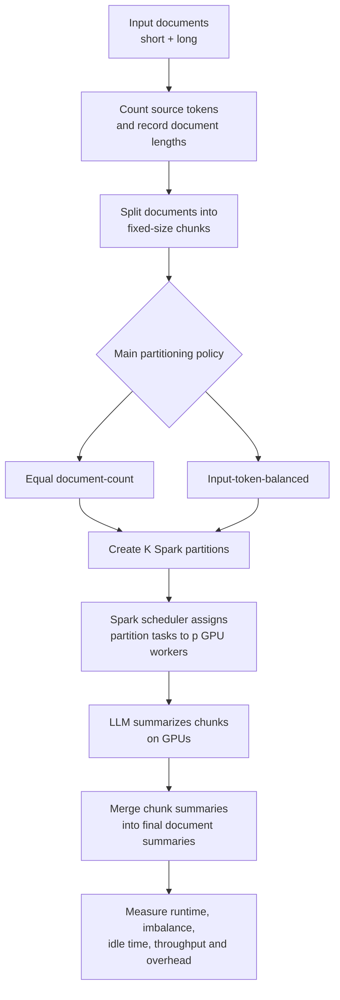
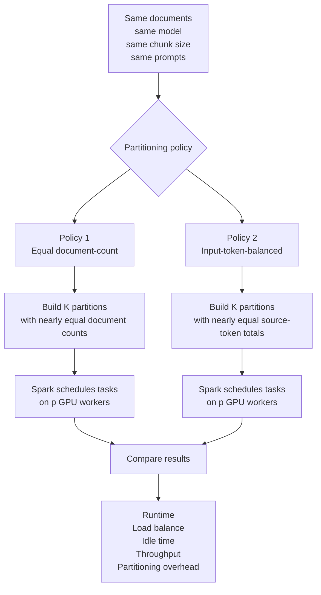
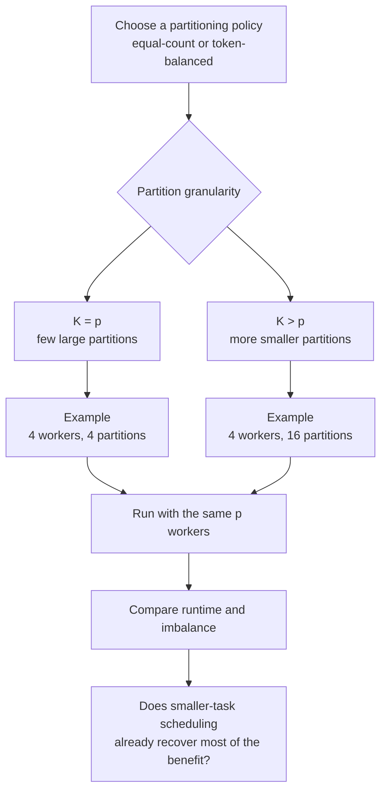
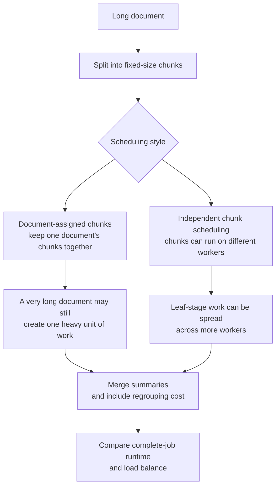
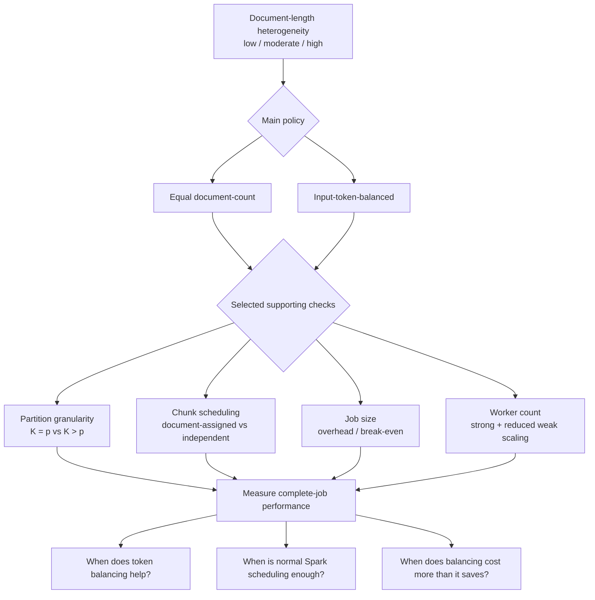
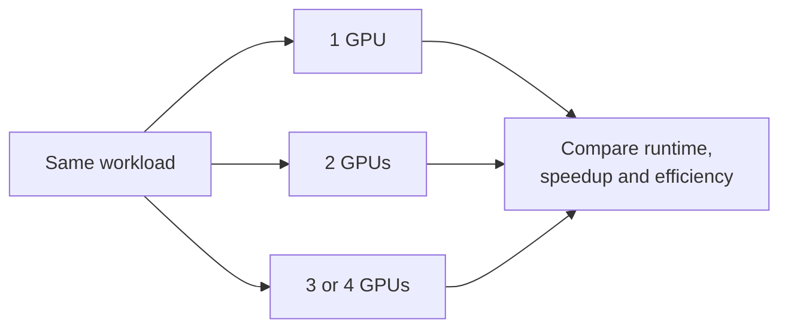
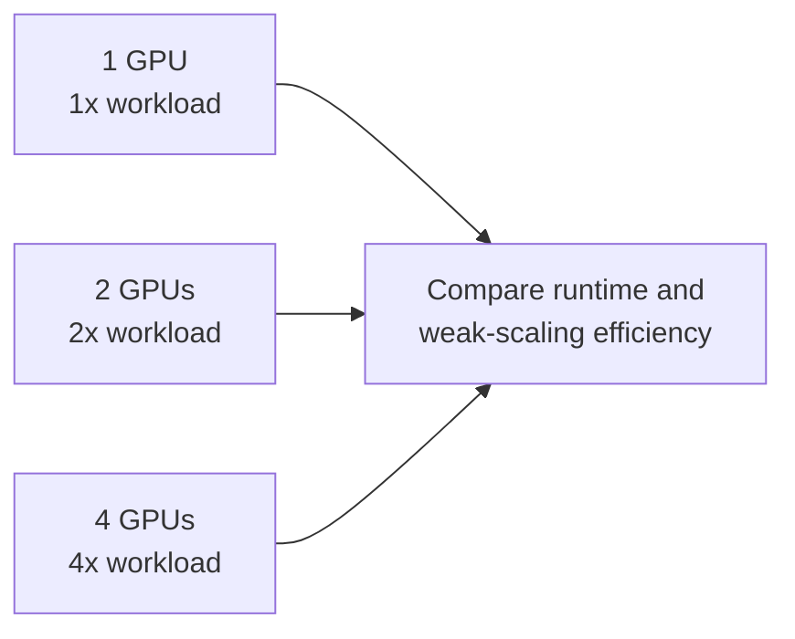

# Spark + LLM Project — Experiment Overview

This is a plain-language companion to the academic proposal. It keeps the same experiment design, but explains what we change, what Spark does, and how the experiments relate.

## Key terms

- **`p` = GPU workers:** how many GPU workers can process work at the same time.
- **`K` = Spark partitions:** how many groups of work Spark creates for a stage.
- **Partition → task:** Spark normally creates one task for each partition in a stage.
- **Partitioning policy:** decides **which documents go into which partitions**.
- **Spark scheduler:** decides **which available worker executes each task**.

So we control the composition and number of partitions; Spark schedules the resulting tasks onto GPU workers.

## 1. Overall experiment

We start with documents of different lengths. Longer documents usually create more chunks and therefore more LLM calls and merge work. The main question is whether this uneven work makes some GPU workers finish earlier than others, and which simple partitioning/scheduling choices reduce that imbalance.

The **core study** varies three things:

1. document-length variability: **low / moderate / high**;
2. partitioning policy: **equal document-count / input-token-balanced**;
3. available GPU-worker count: for example **1 / 2 / 3** or **1 / 2 / 4**.

The model, tokenizer, precision, prompts, chunk size, output limits, batching policy, cache policy and summarization structure stay fixed.

## 2. Main experiment — two partitioning policies

This is the main comparison. Both policies receive the **same documents**, use the **same number of Spark partitions (`K`)**, and run on the **same number of GPU workers (`p`)**.

### Policy 1 — equal document-count

Each partition gets approximately the same **number of documents**, without using document length when assigning them.

The problem is that equal document counts do not mean equal work. A partition containing several long documents may take much longer.

### Policy 2 — input-token-balanced

We use each document's source-token count as a simple estimate of work. Documents are assigned so that the total number of source tokens is approximately balanced across partitions.

This may improve load balance, but it adds token-counting, sorting, assignment and possibly data-movement overhead. Input tokens are also only an estimate: generated tokens, chunk count and merge work can still make two partitions take different amounts of time.

## 3. Supporting experiment — partition granularity

This asks whether **ordinary Spark scheduling with more, smaller tasks already solves much of the imbalance**, even without smarter partitioning.

With `K = p`, each worker may effectively receive one large task. If one partition is much heavier, other workers can finish and wait.

With `K > p`, Spark has more smaller tasks. When a worker finishes one task, Spark can give it another. This may reduce imbalance without estimating token cost.

## 4. Supporting experiment — chunk scheduling

The core experiment keeps the chunks and merge work belonging to one document together. This supporting experiment asks what happens if chunks can instead be scheduled independently.

The question is:

> If Spark can distribute chunks independently, does document-level token balancing still provide useful additional benefit?

Independent chunks may improve the chunk-summarization stage, but regrouping and merging can introduce shuffle, synchronization, or tail costs. We therefore measure the **complete job**, not only individual chunk tasks.

## 5. How the experiments relate

There are **two main partitioning policies**. The other experiments explain *why* one policy helps or does not help.

## 6. Scaling experiments

### Strong scaling — core evaluation

Keep the **same document workload** and increase the number of GPU workers.

Question: does adding more GPUs make the same job proportionally faster, or does load imbalance prevent good speedup?

For the controlled comparison, the document set, `K`, and policy-specific assignment stay fixed while `p` changes.

### Reduced weak scaling — supporting evaluation

Increase the workload approximately in proportion to the number of workers while preserving the document-length distribution and `K/p`.

Question: if we add more GPUs and proportionally more work, can runtime remain roughly stable?

Weak scaling is run only on a smaller subset.

## 7. Overhead / break-even experiment

Token balancing is not free. At fixed worker count, partition count and length distribution, we run **small, medium and larger jobs** and include all balancing costs:

- token counting;
- sorting;
- partition assignment;
- repartitioning / data movement;
- scheduling and serialization where relevant.

The goal is to find when the time saved by better load balance is greater than the extra preparation cost.

## 8. What we measure

For each run we record:

- complete end-to-end job runtime;
- Spark stage makespan;
- task median and maximum duration;
- max/median task-duration ratio;
- worker activity and idle timelines;
- documents/s and source tokens/s;
- source tokens, actual model-input tokens and generated tokens;
- chunk counts and merge-call counts;
- partitioning, sorting, scheduling, serialization and shuffle time;
- sampled GPU utilization as a supporting metric;
- task p95 only when enough task samples exist.

We exclude p99 from the core metrics because the number of tasks per run may be too small for it to be stable.

## 9. Optional extension

Only if input-token balancing still leaves substantial and explainable imbalance, we may test a simple **estimated-compute** policy that uses more information than source-token count, such as predicted generation work.

This is optional and not required for the main conclusions.

## 10. What the project should tell us

The final result should answer:

1. **When does document-length heterogeneity actually hurt Spark + LLM performance?**
2. **When does input-token balancing provide useful benefit?**
3. **When are simpler mechanisms — more Spark partitions or independent chunk scheduling — already sufficient?**
4. **How does this change as the number of GPU workers increases?**
5. **When does balancing overhead cost more than it saves?**

A result showing that token balancing is unnecessary under some conditions is still useful. The goal is to identify **when each approach is worth using**, not to prove that token balancing must win.
