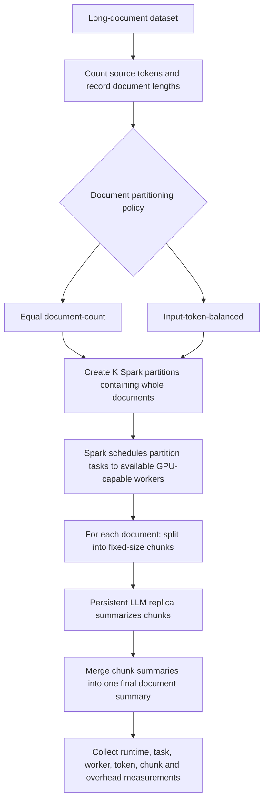
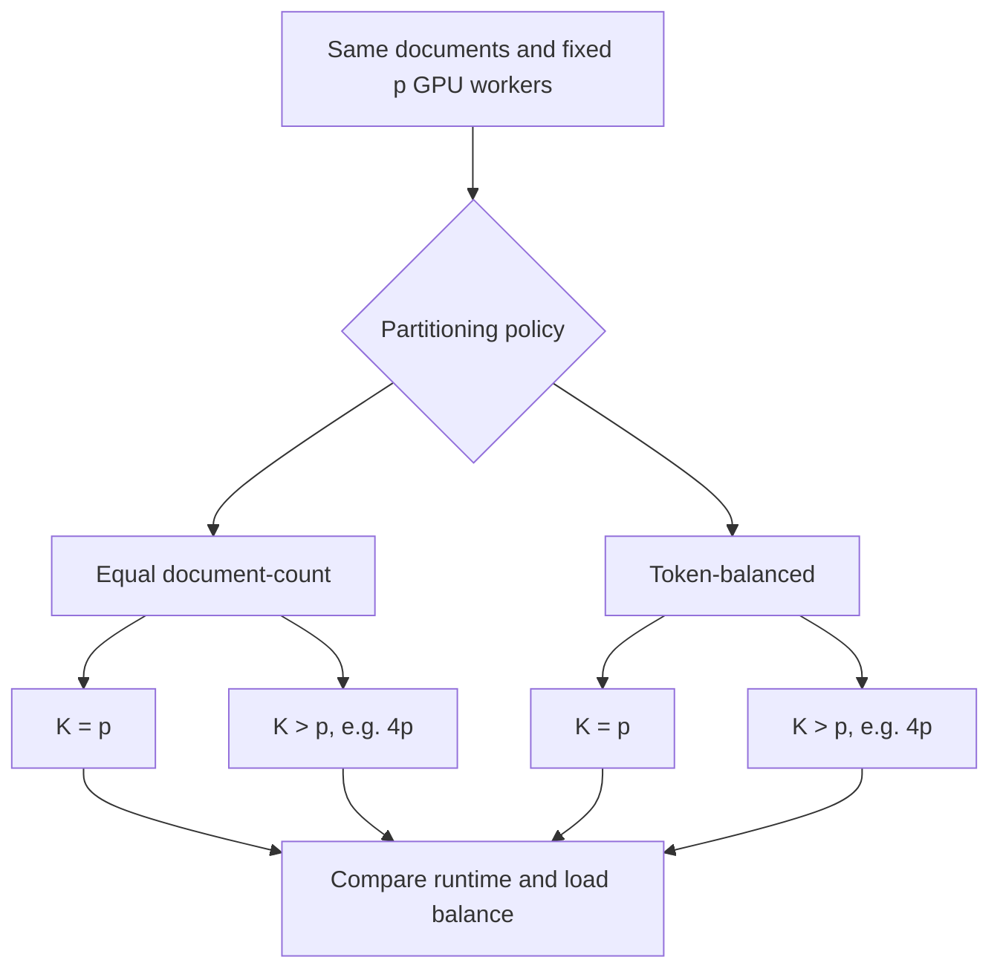
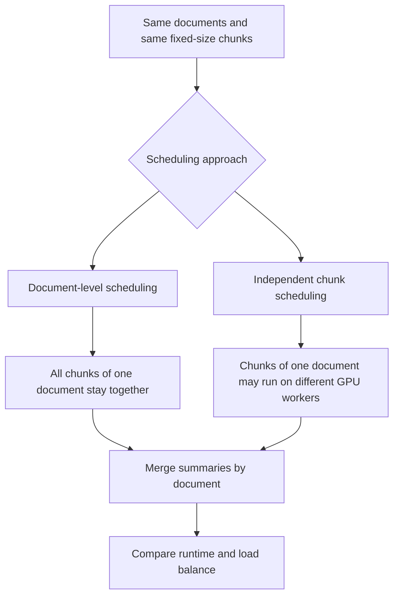
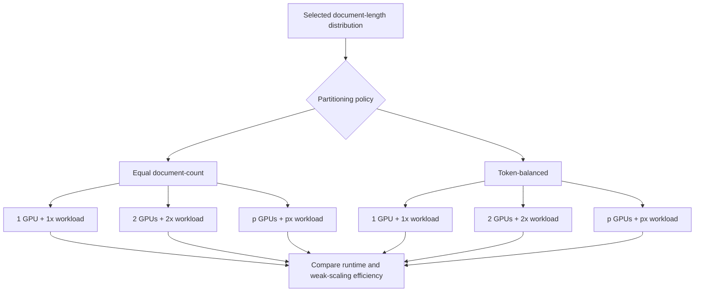
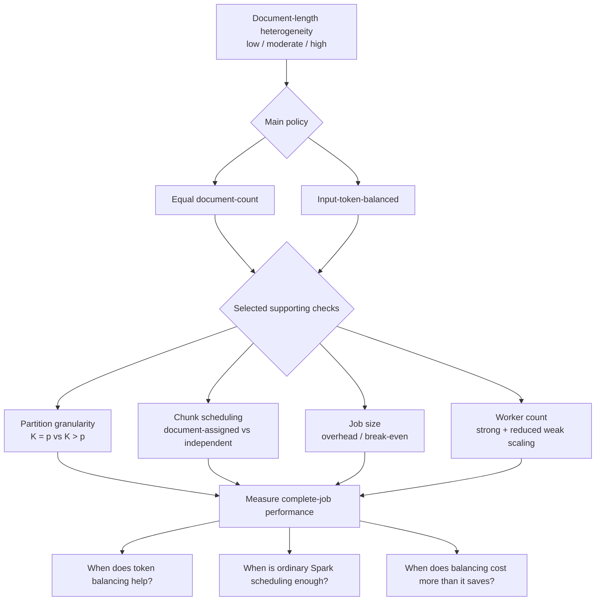

# Document-Length Heterogeneity and Load Balancing in Spark-Based LLM Summarization

## 1. Problem and motivation

We will build a Spark-based pipeline that summarizes long documents with an LLM using multiple GPU workers.

Longer documents usually require more chunks, more LLM calls, and more merge work than shorter documents. If each Spark partition receives the same number of documents, the partitions can still contain very different amounts of work.

For example:

- Partition A: 10 mostly short documents
- Partition B: 10 mostly long documents

Both partitions contain 10 documents, but Partition B may take much longer. Some workers can therefore finish early while a few slow tasks determine the total job time.

Our study asks whether **document-length heterogeneity** creates meaningful load imbalance and whether simple workload-aware partitioning helps beyond Spark's normal scheduling.

Previous work already shows that:

- uneven workloads can leave some workers running much longer than others, while balancing the work adds extra overhead [1];
- LLM processing time depends not only on input length, but also on generated output length and how requests are batched [2,3];
- Spark/PySpark can be used to run data-processing workflows that include LLM calls [4];
- long documents can be split into smaller chunks, summarized separately, and then merged into a final summary [5];
- when later LLM calls depend on earlier results, one slow task can delay the completion of the whole workflow [6];
- we should measure where the actual performance bottleneck is instead of assuming what causes the slowdown [7].

We are **not proposing a new scheduler**. We are testing **when token-aware partitioning is useful, when ordinary Spark scheduling is already enough, and when the extra work required for balancing takes more time than it saves**.

---

## 2. Objective and research questions

### Objective

Determine when differences in document length cause uneven work across GPU workers and increase total job completion time, and when token-aware partitioning saves more time than the extra work needed to perform the balancing.

### Main research question

> **How do differences in document length affect total job completion time and how evenly work is distributed across GPU workers, and when does token-aware partitioning improve performance?**

### Subquestions

1. With the same number of documents and roughly the same total source-token count, does greater variation in document length make some workers take much longer than others?
2. When does input-token-balanced partitioning reduce total job time compared with equal document-count partitioning, and how does this change as we add GPU workers?
3. Can using more, smaller Spark partitions reduce most of the imbalance even without token-aware partitioning?
4. If fixed-size chunks are scheduled independently across workers, does balancing whole documents by token count still provide additional benefit?
5. How large does the workload need to be before the time saved by token-aware partitioning becomes greater than the overhead of token counting, sorting, assignment, and repartitioning?

---

## 3. What we will build

We will build one reproducible Spark + LLM summarization pipeline.

### Intended execution design



Each GPU worker will use its own GPU and keep one LLM copy loaded. Adding more workers therefore adds more GPUs that can process LLM requests in parallel. We will verify this setup during the pilot.

### Important Spark distinction

We control:

- how many partitions (`K`) exist;
- which documents are placed in each partition.

Spark controls which available worker executes each partition task.

We control how documents are grouped into Spark partitions and how large those partitions are. Spark decides which available worker runs each partition.

---

## 4. Core experiment

### 4.1 Main variables

The core study varies three things:

| Variable | Values / treatment |
|---|---|
| **Document-length variability** | Low / moderate / high |
| **Partitioning policy** | Equal document-count / input-token-balanced |
| **GPU workers (`p`)** | 1 and additional comparable GPUs available to us |

Across low-, moderate-, and high-variability workloads, we will keep approximately the same:

- number of documents;
- total source-token count.

We will vary the document-length distribution while keeping document count and total source-token volume approximately matched. The actual LLM work may still differ because workloads can produce different numbers of chunks, generated tokens, and merge calls, so we will measure these during execution.

We will report:

- document-length coefficient of variation (CV);
- maximum document length;
- document count;
- total source-token volume;
- actual chunk counts;
- actual model-input and generated-token counts;
- merge-call counts.

Artificially regrouping text may change factors other than document length, such as content difficulty, generated output length, or chunk/merge behavior, which could also affect runtime.

Therefore, we will repeat the same partitioning comparison on the original, unchanged documents to check whether the result still holds.

### 4.2 What stays fixed

After a feasibility pilot, the main comparisons will keep constant:

- **model** — the same LLM and model size;
- **tokenizer** — the same method used to convert text into tokens;
- **numerical precision** — the same format used for model calculations, such as FP16 or BF16;
- **prompts** — the same instructions for chunk summarization and final merging;
- **chunk size** — the same maximum number of tokens per chunk;
- **summarization structure** — the same split → summarize → merge workflow;
- **output-token limits** — the same maximum generated length;
- **batching policy** — the same rule for grouping requests for GPU processing;
- **cache policy** — the same rules for using or reusing cached model state.

The intended summarization structure is:

1. split each document into fixed-size chunks;
2. summarize the chunks;
3. merge the chunk summaries into one final summary.

The pilot will check that:

- each chunk fits within the model's context window;
- the model and inference workload fit in GPU memory;
- all chunk summaries fit into the final merge step.

We will not allow inputs to be silently cut off if they are too long. If all chunk summaries do not fit into one merge request, we will use the same fixed multi-step merge process in every experiment.

### 4.3 Main partitioning policies

Both policies will use the same documents, the same number of Spark partitions (`K`), and the same number of GPU workers (`p`).

#### Policy A: equal document-count

Documents remain unchanged and are randomly ordered using a fixed seed, without considering document length. They are then distributed so each partition receives nearly the same number of documents.

This is our baseline.

#### Policy B: input-token-balanced

Documents remain unchanged, but we group them so each partition has roughly the same total source-token count. We sort documents from longest to shortest and repeatedly place the next document into the partition that currently has the lowest total token count.

Source-token count is only an estimate of work, so we will also record generated tokens, chunk counts, merge work, and actual task time.

### 4.4 Strong scaling

Strong scaling is part of the core evaluation.

We keep the same document workload and increase only the number of GPU workers.

For each comparison:

- the document set stays the same;
- the number of Spark partitions (`K`) stays the same;
- documents stay assigned to the same partitions;
- only the number of active GPU workers (`p`) changes.

We choose `K` to be at least as large as the maximum `p`.

We measure total runtime, speedup, and scaling efficiency.

Each configuration will be run at least three times in randomized order, and we will report the variation between runs. The exact worker counts and workload size will depend on available hardware and pilot results.


---

## 5. Supporting experiments

### 5.1 Partition granularity

At a fixed number of GPU workers (`p`), we compare the same document workload using different numbers of Spark partitions (`K`):

- `K = p`: the number of partitions equals the number of GPU workers, so partitions are larger;
- `K > p`: more, smaller partitions, for example `K = 4p`. The exact larger value will be finalized after the pilot. This gives Spark more tasks to schedule when a worker finishes the previous one.

Purpose:

> Determine whether using more, smaller Spark partitions reduces load imbalance, and whether token-balanced partitioning still provides additional benefit when `K` is larger.



### 5.2 Chunk scheduling

In the core study, all chunks from the same document stay together and are processed within the same Spark partition. In this supporting experiment, we allow fixed-size chunks from the same document to be scheduled independently. This allows chunks from one long document to run on different workers instead of waiting for one worker to process all of them.

For this comparison, we keep the number of GPU workers (`p`) and chunk-processing Spark partitions (`K`) the same. The only change is whether chunks from the same document stay together or can be scheduled independently.

We compare:

- **Document-level scheduling** — all chunks from the same document stay together;
- **Independent chunk scheduling** — chunks from the same document may run on different GPU workers.

We keep the following unchanged:

- **chunk boundaries** — each document is split at the same points, so both experiments process exactly the same chunks;
- **prompts** — the same LLM instructions are used for chunk summarization and final merging;
- **merge structure** — chunk summaries are combined using the same sequence of merge steps;
- **summary order** — chunk summaries are merged in the original document order, not in the order in which GPU workers finish them.

After chunk processing, summaries are regrouped by document and merged using the same procedure as in the core study.

Any additional cost caused by independent chunk scheduling, including shuffle, regrouping, synchronization, and merge overhead, is included in the complete-job runtime.



### 5.3 When is token-aware partitioning worth the extra work?

Token-aware partitioning is not free.

At fixed worker count, partition count, and document-length distribution, we will vary the total workload size and measure the cost of:

- token counting;
- sorting documents by token count;
- assigning documents to balanced partitions;
- reorganizing / moving documents into those partitions;
- any additional Spark scheduling or data-transfer overhead caused by this process.

Purpose:

> Find the total source-token volume at which token-aware partitioning saves more runtime than the extra time required to prepare the balanced partitions.

### 5.4 Reduced weak scaling

We will test weak scaling only for selected configurations of the two main partitioning policies.

For both partitioning policies, we will increase the workload proportionally as the number of GPU workers (`p`) increases.

We will increase both document count and total source-token volume while keeping:

- the same document-length distribution;
- approximately the same number of Spark partitions per worker (`K/p`).

The exact value of `p` will depend on the comparable GPUs available after the pilot.



Purpose:

> Determine whether increasing GPU capacity allows us to process proportionally more work in roughly the same amount of time.

### How the experiments relate




---

## 6. Measurements

### Primary measurements

For each run, we will collect:

- **end-to-end job runtime** — total time from starting the job until all final summaries are produced;
- **LLM-processing stage runtime** — time from the start of the first Spark task performing LLM work until the last such task finishes;
- **median task duration** — typical task execution time;
- **maximum task duration** — duration of the slowest task;
- **max/median task-duration ratio** — how much slower the slowest task is compared with a typical task;
- **worker activity and idle timelines** — when each GPU worker is processing work and when it is waiting idle;
- **documents per second** — document-processing throughput;
- **source tokens per second** — input-token-processing throughput.


Example:

```
Token counting + partitioning:   5 s
Spark setup/scheduling:          3 s
LLM processing:                 60 s
Final merge / other overhead:    7 s
------------------------------------
End-to-end runtime:             75 s
```

### Measurements used to explain the result

We will also record:

- **source tokens** — total number of tokens in the original documents;
- **actual model-input tokens** — tokens actually sent to the LLM, including prompts and any intermediate summaries;
- **generated tokens** — total number of tokens produced by the LLM;
- **chunk count** — total number of document chunks processed;
- **merge-call count** — number of LLM calls used to combine chunk summaries;
- **partitioning time** — time spent creating the document-to-partition assignment;
- **sorting time** — time spent sorting documents by token count for token-aware partitioning;
- **scheduling time** — time Spark spends preparing and assigning tasks for execution;
- **serialization time** — time spent converting data into a form that Spark can transfer between processes or machines;
- **shuffle / data-movement time** — time spent moving data between Spark partitions or workers;
- **model initialization time** — time spent loading and preparing the LLM on each GPU worker;
- **GPU utilization** — sampled percentage of GPU capacity being used while the job runs.

These measurements help explain whether runtime differences come from workload size, LLM generation, load imbalance, or Spark/partitioning overhead.

We may also report the 95th percentile of task duration (p95) when a run contains enough tasks. This shows how slow the longest few tasks are compared with typical tasks. We will not use p99 because the number of tasks may be too small for it to be reliable.

### Scaling metrics

For strong scaling, we keep the workload fixed and increase the number of GPU workers (`p`).

- **Speedup** — how many times faster the job becomes compared with one GPU worker:

  `S(p) = T(1) / T(p)`

  where `T(1)` is the runtime with one GPU worker and `T(p)` is the runtime with `p` GPU workers.

- **Scaling efficiency** — how close the speedup is to ideal linear scaling:

  `Efficiency = S(p) / p`

  For example, with 4 GPU workers, a speedup of 4× would give an efficiency of 1.0, or 100%.

For weak scaling, we increase the workload proportionally with the number of GPU workers and compare whether runtime stays approximately constant.

---

## 7. Expected contribution

The project will provide empirical evidence about:

- when differences in document length create significant load imbalance and longer job runtime;
- when source-token-balanced partitioning improves performance;
- when using more, smaller Spark partitions is already sufficient;
- when independent chunk scheduling is sufficient;
- how these results change as the number of GPU workers increases;
- when the extra cost of token-aware partitioning is greater than the runtime it saves.

If token balancing does not help in some cases, that is still a useful result because it shows when a simpler Spark configuration is sufficient.

---

## 8. Risks and controls

| Risk | What we will do |
|---|---|
| Token-aware partitioning provides little benefit once chunks are scheduled independently | Treat this as a valid result and identify the conditions where simpler chunk-level scheduling is sufficient |
| Source-token count does not accurately predict processing time | Use generated tokens, chunk counts, merge calls, and measured task durations to explain why some partitions still take longer |
| Too few comparable GPUs are available | Limit scaling experiments and conclusions to the worker configurations we can actually test |
| LLM inference dominates Spark overhead | Measure both and report where the runtime is actually spent instead of assuming Spark is the bottleneck |
| Artificially changing document lengths may also change other factors that affect runtime | Repeat the main partitioning comparison on the original, unchanged documents |
| The number of experiment combinations may become too large | Keep secondary variables fixed and run supporting experiments only on selected configurations |
| A bug or scheduling issue may cause some documents or chunks to be skipped, making a run appear faster | Verify that every document and chunk is processed before comparing runtimes |
| The combined chunk summaries may be too large for one final LLM merge call | Use a fixed multi-step merge procedure and verify that no summaries are silently truncated |

---

## 9. Optional extension

If source-token-balanced partitioning still leaves large differences in task runtime, we may test an **estimated-compute** partitioning policy.

Instead of using only source-token count, this policy would estimate the expected work for each document using factors such as:

- source-token count;
- expected generated-token work;
- number of chunks and LLM calls.

The estimate would be created using separate pilot runs, not using timing or output information from the evaluation runs themselves.

We would then balance partitions using this estimated workload instead of source-token count alone.

This is optional and is not required for the main project results.

---

## 10. Work plan

1. **Feasibility pilot**
   - confirm which comparable GPUs are available;
   - verify that Spark workers can run LLM inference on those GPUs;
   - choose an LLM model that fits the available GPU memory;
   - verify that chunking and merging fit the model context limits;
   - choose a document dataset with enough long documents and suitable variation in document length for the experiments;

2. **Pipeline implementation**
   - build the Spark + GPU execution pipeline;
   - implement fixed-size chunking, chunk summarization, and final merging;
   - implement equal document-count partitioning;
   - implement source-token-balanced partitioning.

3. **Measurement and correctness checks**
   - record how long individual Spark tasks, the main LLM-processing stage, and the complete job take;
   - record when each GPU worker is busy and when it is waiting idle;
   - record the number of processed tokens, chunks, and merge calls, as well as throughput and the extra time required for token-aware partitioning;
   - verify that every document and chunk is processed and that no LLM input is silently cut off because of context limits.

4. **Core experiments**
   - run the same type of workload with low, moderate, and high document-length variability while keeping document count and total source-token volume approximately matched;
   - compare equal document-count and token-balanced partitioning on the same workload and worker configuration;
   - repeat the comparison using the available numbers of comparable GPU workers;
   - evaluate strong scaling by keeping the workload fixed, increasing the number of GPU workers, and measuring runtime, speedup, and scaling efficiency.

5. **Supporting experiments**
   - compare different numbers of Spark partitions;
   - compare document-level and independent chunk scheduling;
   - determine how large the workload must be before the runtime saved by token-aware partitioning is greater than the extra time spent counting tokens, sorting documents, assigning them to balanced partitions, and moving data;
   - run reduced weak-scaling experiments on selected configurations.

6. **Analysis**
   - compare runtime, load balance, and throughput;
   - use measured task times, worker idle time, token counts, chunk counts, merge calls, and partitioning overhead to explain why one configuration performs better or worse than another;
   - identify when each partitioning or scheduling approach is useful.

Implementation work will be divided across:

- workload construction and correctness;
- Spark execution and partitioning;
- instrumentation and benchmark analysis.

We will save the experiment configurations, workload seeds, and results needed to reproduce the main experiments.

---

## References

[1] Y. Kwon et al. “SkewTune: Mitigating Skew in MapReduce Applications.” SIGMOD, 2012.  
https://doi.org/10.1145/2213836.2213840

[2] Y. Jin et al. “S³: Increasing GPU Utilization during Generative Inference for Higher Throughput.” NeurIPS, 2023.  
https://proceedings.neurips.cc/paper_files/paper/2023/file/3a13be0c5dae69e0f08065f113fb10b8-Paper-Conference.pdf

[3] Y. Zhao et al. “BlendServe: Optimizing Offline Inference with Resource-Aware Batching.” ASPLOS, 2026.  
https://doi.org/10.1145/3779212.3790133

[4] S. Liu et al. “Optimizing LLM Queries in Relational Data Analytics Workloads.” MLSys, 2025.  
https://proceedings.mlsys.org/paper_files/paper/2025/file/b5dc49f44db2fadc5c4d717c57f4a424-Paper-Conference.pdf

[5] Z. Zhou et al. “LLM×MapReduce: Simplified Long-Sequence Processing using Large Language Models.” ACL, 2025.  
https://aclanthology.org/2025.acl-long.1341/

[6] C. Lin et al. “Parrot: Efficient Serving of LLM-based Applications with Semantic Variable.” OSDI, 2024.  
https://www.usenix.org/conference/osdi24/presentation/lin-chaofan

[7] K. Ousterhout et al. “Making Sense of Performance in Data Analytics Frameworks.” NSDI, 2015.  
https://www.usenix.org/conference/nsdi15/technical-sessions/presentation/ousterhout
