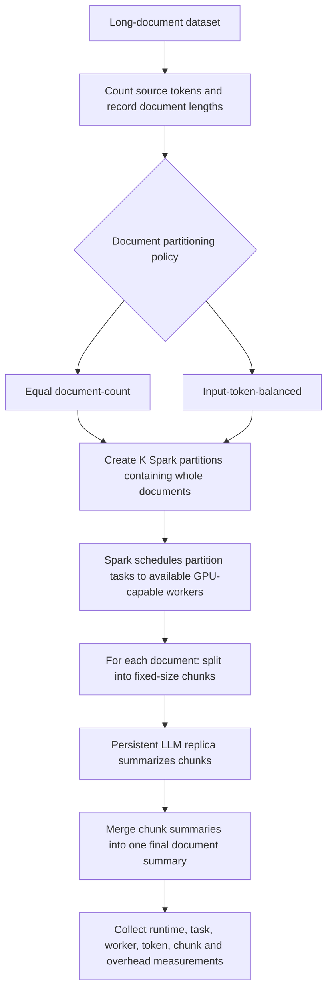
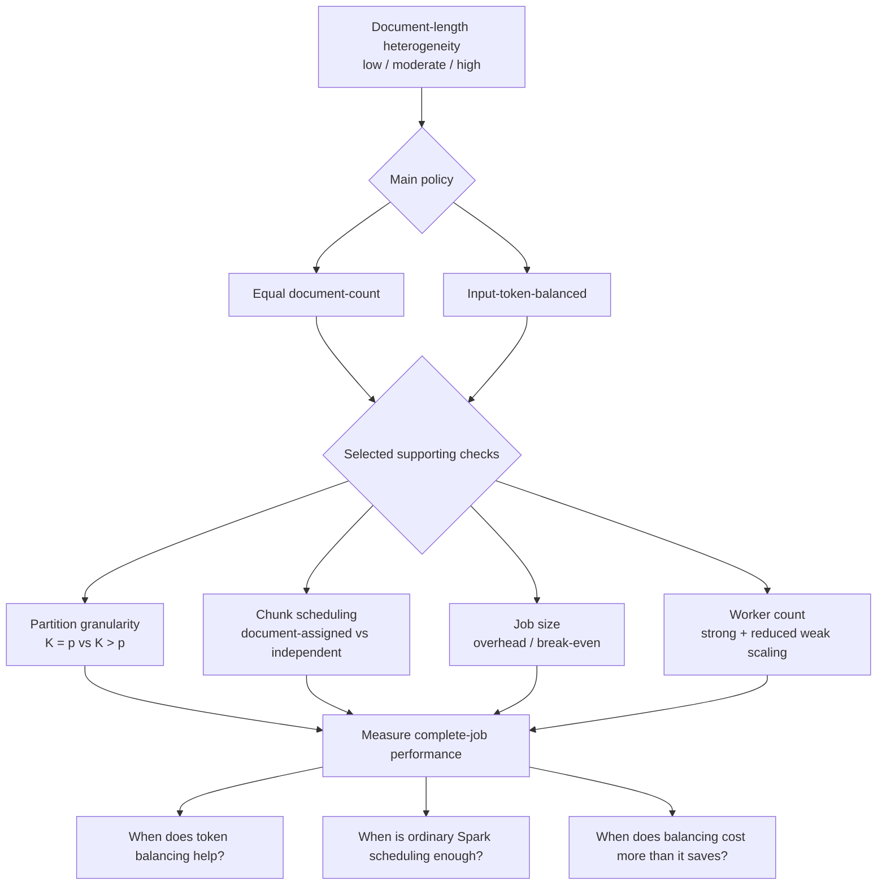

# Document-Length Heterogeneity and Load Balancing in Spark-Based LLM Summarization

## 1. Problem and motivation

We will build a Spark-based pipeline that summarizes long documents with an LLM using multiple GPU workers.

Longer documents usually require more chunks, more LLM calls, and more merge work than shorter documents. If each Spark partition receives the same number of documents, the partitions can still contain very different amounts of work.

For example:

- Partition A: 10 mostly short documents
- Partition B: 10 mostly long documents

Both partitions contain 10 documents, but Partition B may take much longer. Some workers can therefore finish early while a few slow tasks determine the total job time.

Our study asks whether **document-length heterogeneity** creates meaningful load imbalance and whether simple workload-aware partitioning helps beyond Spark's normal scheduling.

Previous work already shows that:

- skewed workloads can create stragglers, and mitigating skew has its own cost [1];
- LLM inference cost depends on more than input length, including generated tokens and batching [2,3];
- Spark can be combined with LLM processing [4];
- long documents can be processed using split-and-merge LLM workflows [5];
- application completion time matters when LLM calls depend on one another [6];
- performance bottlenecks should be measured rather than assumed [7].

We are **not proposing a new scheduler**. We are testing **when token-aware partitioning is useful, when ordinary Spark scheduling is already enough, and when balancing overhead costs more than it saves**.

---

## 2. Objective and research questions

### Objective

Determine when document-length variability hurts runtime and load balance, and when the benefit of workload-aware partitioning is larger than its overhead.

### Main research question

> **How does document-length heterogeneity affect completion time and load balance in Spark-based LLM summarization, and under what conditions does workload-aware partitioning improve scalability?**

### Subquestions

1. With the same document count and approximately the same total source-token volume, does higher document-length variability increase runtime and imbalance?
2. When does input-token-balanced partitioning perform better than equal document-count partitioning, and does the answer change as we add GPU workers?
3. Does using more, smaller Spark partitions already remove most of the imbalance?
4. If fixed-size chunks are scheduled independently, does document-level balancing still provide useful additional benefit?
5. At what workload size does the cost of token-aware partitioning become smaller than the runtime it saves?

---

## 3. What we will build

We will build one reproducible Spark + LLM summarization pipeline.

### Intended execution design

The exact Spark-to-GPU mapping will be verified during the feasibility pilot. The intended design is that each GPU worker uses a persistent model replica so that adding GPU workers increases actual inference capacity rather than only adding CPU-side Spark executors.

### Important Spark distinction

We control:

- how many partitions (`K`) exist;
- which documents are placed in each partition.

Spark controls which available worker executes each partition task.

We are therefore studying **partition composition and task granularity**, not manually assigning specific documents to named machines.

---

## 4. Core experiment

### 4.1 Main variables

The core study varies three things:

| Variable | Values / treatment |
|---|---|
| **Document-length variability** | Low / moderate / high |
| **Partitioning policy** | Equal document-count / input-token-balanced |
| **GPU workers (`p`)** | 1 and additional comparable GPUs available to us |

Across low-, moderate-, and high-variability workloads, we will keep:

- document count matched;
- total source-token volume approximately matched.

We will report:

- document-length coefficient of variation (CV);
- maximum document length;
- document count;
- total source-token volume;
- actual chunk counts;
- actual model-input and generated-token counts;
- merge-call counts.

If controlled workloads require regrouping text, we will also validate the main comparison on intact documents.

### 4.2 What stays fixed

After a feasibility pilot, the main comparisons will keep constant:

- model;
- tokenizer;
- numerical precision;
- prompts;
- chunk size;
- summarization structure;
- output-token limits;
- batching policy;
- cache policy.

The intended summarization structure is:

1. split each document into fixed-size chunks;
2. summarize the chunks;
3. merge the chunk summaries into one final summary.

The pilot will verify that this fits the selected model context window and GPU memory. Silent truncation is not acceptable. If a one-step merge cannot fit safely, we will use a fixed context-safe rule while keeping the same rule across experiments.

### 4.3 Main partitioning policies

Both policies receive the **same documents**, use the **same `K`**, and run with the **same `p`**.

#### Policy A: equal document-count

Documents are assigned using a seeded, length-independent ordering so that partition document counts differ by at most one.

This is the simple baseline.

#### Policy B: input-token-balanced

Documents are assigned so that total source-token counts are approximately balanced across partitions. We will sort documents by decreasing source-token count and assign each next document to the partition with the lowest current token total.

This is an existing assignment heuristic, not a new algorithm.

Input-token count is only an estimate of work. We will separately record generated tokens, chunk counts, merge work, and actual task duration to determine when token totals do or do not predict execution cost.

### 4.4 Strong scaling

Strong scaling is part of the core evaluation.

We keep the same document workload and increase the number of GPU workers.

For the controlled comparison:

- the document set stays fixed;
- `K` stays fixed;
- the policy-specific partition assignment stays fixed;
- only the number of concurrent GPU workers changes.

We will choose `K` to be at least as large as the maximum tested `p`.

We will compare runtime, speedup, and efficiency.

We will use at least three paired repetitions per configuration, randomize run order, and report run-to-run variation. The exact worker counts will depend on verified hardware access, while pilot runtime will determine the feasible workload size.

---

## 5. Supporting experiments

These are **not additional main algorithms**. They help explain why token balancing helps or does not help.

### 5.1 Partition granularity

At fixed `p`, compare:

- `K = p`: fewer, larger partitions;
- `K > p`, for example `K = 4p`: more, smaller partitions.

Purpose:

> Determine whether ordinary Spark scheduling of smaller tasks already removes most of the imbalance.

### 5.2 Chunk scheduling

The core study keeps the chunks and merge work belonging to one document together.

A supporting experiment compares this with allowing fixed-size chunks to be scheduled independently across workers.

We will preserve:

- chunk boundaries;
- prompts;
- merge structure;
- summary order.

Any shuffle, regrouping, synchronization, or merge cost introduced by independent chunk scheduling will be included in the complete-job measurement.

We will analyze the chunk stage, merge stage, and full job separately where possible.

Purpose:

> Determine whether finer chunk-level scheduling makes document-level token balancing unnecessary.

### 5.3 Overhead / break-even

Token-aware partitioning is not free.

At fixed worker count, partition count, and length distribution, we will vary total job size and include the cost of:

- token counting;
- sorting;
- assignment;
- repartitioning / data movement;
- scheduling and serialization where relevant.

Purpose:

> Identify when the runtime saved through better load balance becomes larger than the extra balancing cost.

### 5.4 Reduced weak scaling

Weak scaling will be run only on a limited subset.

As `p` increases, we will increase:

- document count proportionally;
- total source-token volume proportionally.

We will preserve the document-length distribution and `K/p`.

Purpose:

> Test whether the system can handle proportionally more work as GPU capacity increases without a similar increase in runtime.

### How the experiments relate

---

## 6. Measurements

### Primary measurements

For each run we will collect:

- end-to-end job runtime through completed summaries;
- Spark stage makespan;
- task median duration;
- task maximum duration;
- max/median task-duration ratio;
- worker activity and idle timelines;
- documents per second;
- source tokens per second.

### Measurements used to explain the result

We will also record:

- source tokens;
- actual model-input tokens;
- generated tokens;
- chunk counts;
- merge-call counts;
- partitioning time;
- sorting time;
- scheduling time;
- serialization time;
- shuffle / data-movement time;
- model initialization separately;
- sampled GPU utilization as a supporting metric.

Task p95 will be used only when enough task samples exist. p99 is not a core metric because the number of tasks in a run may be too small for it to be stable.

### Scaling metrics

For strong scaling:

- speedup: `S(p) = T(1) / T(p)`;
- efficiency: `S(p) / p`.

For weak scaling, we will compare runtime while workload and worker count increase proportionally.

---

## 7. Expected contribution

The project should provide an empirical answer to:

- when document-length heterogeneity becomes a real performance problem;
- when source-token balancing improves performance;
- when ordinary Spark scheduling with more partitions is sufficient;
- when independent chunk scheduling is sufficient;
- how these effects change as GPU-worker count increases;
- when partitioning overhead costs more than it saves.

We are **not claiming a new scheduling algorithm**.

A result showing that token balancing does not help under some conditions is still useful because it identifies when the simpler Spark configuration is enough.

---

## 8. Risks and controls

| Risk | What we will do |
|---|---|
| Independent chunk scheduling removes most imbalance | Treat this as a valid result and inspect remaining merge-stage tails |
| Source-token count predicts work poorly | Explain results using generated tokens, chunk counts, merge calls, and measured task durations |
| Limited comparable GPUs | Limit scaling claims to worker configurations we can actually run |
| LLM inference dominates Spark overhead | Measure and report this instead of assuming Spark is the bottleneck |
| Controlled/regrouped workloads are unrealistic | Validate the main comparison on intact documents |
| Experiment matrix becomes too large | Keep secondary variables fixed and run supporting experiments only on selected cases |
| A faster run accidentally skips work | Verify complete document and chunk coverage |
| Merge inputs exceed context | Enforce a context-safe merge rule and check for truncation |

---

## 9. Optional extension

Only if input-token balancing leaves substantial and explainable residual imbalance, we may test a simple **estimated-compute** policy that uses more information than source-token count.

Possible inputs could include:

- source-token count;
- expected generation work;
- chunk / call count.

This extension would be calibrated on separate pilot data and would not use future measured outputs from evaluation jobs.

It is **not required for the main project conclusions**.

---

## 10. Work plan

1. **Feasibility pilot**
   - confirm available comparable GPUs;
   - confirm Spark executors can use them;
   - select a model that fits;
   - validate the summarization structure and context limits;
   - select and validate the dataset.

2. **Pipeline implementation**
   - Spark + GPU execution;
   - fixed chunk + merge summarization;
   - equal-count partitioning;
   - token-balanced partitioning.

3. **Instrumentation**
   - task / stage timing;
   - worker activity;
   - token, chunk, merge, throughput, and overhead counters;
   - output and truncation checks.

4. **Core experiments**
   - three variability levels;
   - two partitioning policies;
   - available GPU-worker counts;
   - strong scaling.

5. **Selected supporting experiments**
   - partition granularity;
   - chunk scheduling;
   - overhead / break-even;
   - reduced weak scaling.

6. **Analysis**
   - compare runtime and load balance;
   - explain differences using realized work counters;
   - identify the conditions where each approach is useful.

Implementation work will be divided across:

- workload construction and correctness;
- Spark execution and partitioning;
- instrumentation and benchmark analysis.

---

## References

[1] Y. Kwon et al. “SkewTune: Mitigating Skew in MapReduce Applications.” SIGMOD, 2012.  
https://doi.org/10.1145/2213836.2213840

[2] Y. Jin et al. “S³: Increasing GPU Utilization during Generative Inference for Higher Throughput.” NeurIPS, 2023.  
https://proceedings.neurips.cc/paper_files/paper/2023/file/3a13be0c5dae69e0f08065f113fb10b8-Paper-Conference.pdf

[3] Y. Zhao et al. “BlendServe: Optimizing Offline Inference with Resource-Aware Batching.” ASPLOS, 2026.  
https://doi.org/10.1145/3779212.3790133

[4] S. Liu et al. “Optimizing LLM Queries in Relational Data Analytics Workloads.” MLSys, 2025.  
https://proceedings.mlsys.org/paper_files/paper/2025/file/b5dc49f44db2fadc5c4d717c57f4a424-Paper-Conference.pdf

[5] Z. Zhou et al. “LLM×MapReduce: Simplified Long-Sequence Processing using Large Language Models.” ACL, 2025.  
https://aclanthology.org/2025.acl-long.1341/

[6] C. Lin et al. “Parrot: Efficient Serving of LLM-based Applications with Semantic Variable.” OSDI, 2024.  
https://www.usenix.org/conference/osdi24/presentation/lin-chaofan

[7] K. Ousterhout et al. “Making Sense of Performance in Data Analytics Frameworks.” NSDI, 2015.  
https://www.usenix.org/conference/nsdi15/technical-sessions/presentation/ousterhout
